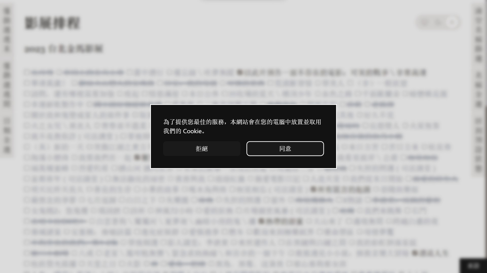

# Cookie

結合 Cookie 和 `<dialog>` 的所學製作的「本網站使用 Cookie 確認彈窗」

## 展示



[Live Demo](https://nepikn.github.io/cookie/)

## 學習內容

### Cookie

```js
// example.com
document.cookie = "consent=true; samesite=lax; max-age=3600";
```

```HTTP
Set-Cookie: sessionId=0; HttpOnly
```

- `consent=true` 並不會覆蓋所有 cookie 而僅編輯 `consent`
- `samesite=lax` 從 example.com 以外的網頁（或從記事本等軟體）訪問 example.com 所發送的請求也同樣包含本 cookie
- 無 `expires` 或 `max-age` 則隨瀏覽器關閉而被移除、`expires=0`/`expires=-1` 來主動移除
- `HttpOnly` 僅限伺服器設定來限制客戶端 JavaScript 讀取

### Dialog

```html
<dialog>
  <form method="dialog">
    <p>為了提供您最佳的服務，本網站會在您的電腦中放置並取用我們的 Cookie。</p>
    <button class="deny">拒絕</button>
    <button autofocus class="consent">同意</button>
  </form>
</dialog>
```

```css
dialog::backdrop {
  backdrop-filter: blur(4px);
}
```

```js
if (Cookies.get("consent") != "true") {
  dialog.showModal();
}
```

- `<dialog>` 顯示時將由瀏覽器顯示在長寬等同 viewport 的最頂層
- 可用 `::backdrop` 調整自身周遭的樣式
- `dialog.showModal()` 後無法與 `<dialog>` 之外的元件互動、`dialog.show()` 不限制互動
- `<form method="dialog">` 不發送表單而是關閉包含自身的 `<dialog>`
